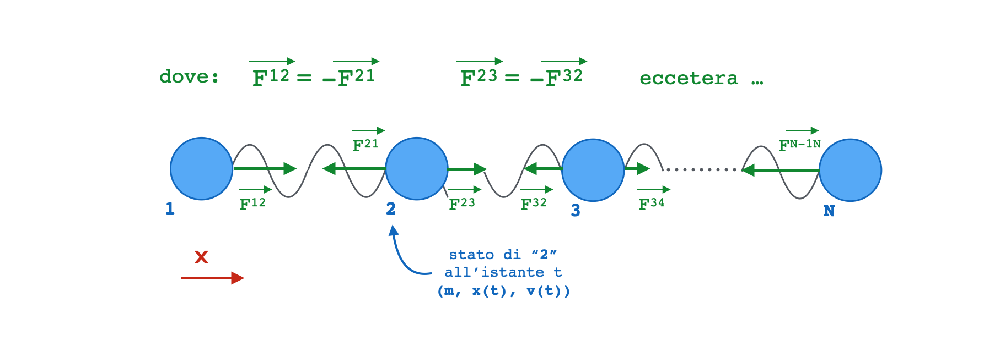

# Laboratorio 7

In questo laboratorio utilizzeremo alcuni concetti appresi durante le lezioni
per sviluppare semplice programma (_toy model_) che calcola, tramite un metodo
di integrazione numerica, l'evoluzione dinamica di un sistema composto da più
punti materiali interagenti.

- [Laboratorio 7](#laboratorio-7)
  - [Area di lavoro](#area-di-lavoro)
  - [Obiettivo finale](#obiettivo-finale)
  - [Traduzione del problema in C++](#traduzione-del-problema-in-c)
    - [Primo passo: stato di un punto materiale](#primo-passo-stato-di-un-punto-materiale)
    - [Secondo passo: forza generata da una molla](#secondo-passo-forza-generata-da-una-molla)
    - [Terzo passo: implementazione di `Chain`](#terzo-passo-implementazione-di-chain)
      - [Un semplice modello di integrazione numerica](#un-semplice-modello-di-integrazione-numerica)
      - [Implementazione di `evolve`: prima approssimazione](#implementazione-di-evolve-prima-approssimazione)
      - [Implementazione di `evolve`: versione completa](#implementazione-di-evolve-versione-completa)
  - [Un _main program_ che utilizza la classe `Chain`](#un-main-program-che-utilizza-la-classe-chain)
  - [Alcune considerazioni](#alcune-considerazioni)
  - [Consegna facoltativa del lavoro svolto](#consegna-facoltativa-del-lavoro-svolto)
  - [Approfondimenti ed esercizi](#approfondimenti-ed-esercizi)
    - [Trasformare `Chain` in un `class template`](#trasformare-chain-in-un-class-template)
    - [Utilizzare `algorithm` in `main.cpp`](#utilizzare-algorithm-in-maincpp)
      - [Funzione `print_summary` che utilizza `std::accumulate`](#funzione-print_summary-che-utilizza-stdaccumulate)
      - [Funzione `print_state`](#funzione-print_state)
      - [Inserimento dei punti della `Chain` tramite `generate_n`](#inserimento-dei-punti-della-chain-tramite-generate_n)
    - [Utilizzare `std::transform` in `Chain::evolve`](#utilizzare-stdtransform-in-chainevolve)

## Area di lavoro

Creiamo una nuova directory di lavoro (ad esempio `pf_labs/lab7`) e aggiungiamo
il file `.clang-format`. Possiamo copiarlo dalla cartella utilizzata per il primo
laboratorio, o generarlo ex-novo.

> :exclamation: Per esempio, potremmo procedere in modo analogo a quanto fatto
> [qui](../lab1/README.md#area-di-lavoro).

In seguito scarichiamo il file
[`doctest.h`](https://raw.githubusercontent.com/doctest/doctest/master/doctest/doctest.h)
tramite il seguente comando:

```bash
$ pwd
/home/fferrari/pf_labs/lab7
$ curl https://raw.githubusercontent.com/doctest/doctest/master/doctest/doctest.h -o doctest.h
```

Suggeriamo inoltre di scaricare il file `CMakeLists.txt` tramite il seguente
comando:

```bash
$ curl https://raw.githubusercontent.com/Programmazione-per-la-Fisica/labs2022/main/lab5/soluzioni/CMakeLists.txt -o CMakeLists.txt
```

e di modificarlo man mano che svilupperete il progetto, per semplificare la
compilazione del progetto stesso.

Infine, chi lo desidera potrà utilizzare Git durante la fase di sviluppo.

## Obiettivo finale

L'obiettivo finale dell'esercizio è quello di costruire un oggetto `Chain`, in
grado di descrivere l'evoluzione di una catena di punti materiali (o _physics
points_), i quali:

- sono liberi di muoversi in una dimensione (es. lungo l'asse _x_);
- sono collegati l'uno all'altro tramite molle.

**Assumiamo inoltre che**:

- ogni molla applichi una forza, uguale in modulo ma di verso opposto, ai
  punti materiali che connette (es. per _1_ e _2_ : _F_<sup>12</sup> = - _F_<sup>21</sup>);
- le forze applicate da molle diverse, siano in un dato momento, in generale
  diverse (es. |_F_<sup>12</sup>| &ne; |_F_<sup>23</sup>| ...);
- i punti materiali agli estremi della catena (_1_ ed _N_) interagiscano con
  un solo "vicino" (es. _1_ interagisce solo con _2_);
- tutti gli altri punti (da _2_ a _N-1_) interagiscano col loro vicino "a
  destra" e con quello "a sinistra" (es. _2_ interagisce con _1_ e _3_);
- tutte le molle siano identiche (abbiano la medesima costante elastica _k_ e
  lunghezza a riposo _l_).

Uno schema che descrive graficamente il sistema è mostrato qui:



**Il progetto sembra complesso!**

Come spesso si fa in questi casi, per realizzare la soluzione finale del
problema, procederemo **un passo alla volta**, **fattorizzando lo sviluppo**
delle diverse componenti.

Prima di sviluppare nuove funzionalità, vi verrà chiesto di preparare alcuni
test per verificarne il corretto funzionamento.

Possiamo strutturare il programma tramite due classi, ognuna che avrà il suo
_header file_ e il corrispondente file `.cpp` dove verranno implementati i metodi
della classe. La prima classe, `Hooke`, ci permetterà di calcolare la forza tra
due punti materiali, mentre la seconda classe, `Chain`, ci servirà per
rappresentare una catena di punti materiali.

In seguito proporremo nomi ed interfacce per le varie `struct` e `class` da
sviluppare. Indipendentemente dall'implementazione, vi chiediamo di rispettare
le interfacce, poiché,
[in seguito](#un-main-program-che-utilizza-la-classe-chain), forniremo un file
`main.cpp` che fa uso del codice che avete sviluppato.

## Traduzione del problema in C++

Come anticipato,andremo a scomporre il problema proposto, suddividendolo in
diverse parti che, in generale, risulteranno testabili separatamente.

Più in dettaglio, utilizzeremo:

- una _struct_ per descrivere lo stato di ciascuno dei punti materiali che
  compongono la nostra catena (`ParticleState`);
- un _function object_ che descrive l'interazione tra due punti materiali,
  secondo la legge di _Hooke_ (`Hooke`);
- una _class_ `Chain` che ci permetterà di "costruire" la nostra catena di punti
  materiali collegati da molle, e di calcolarne la dinamica tramite l'uso
  di un semplice
  [modello di integrazione numerica](#un-semplice-modello-di-integrazione-numerica).

### Primo passo: stato di un punto materiale

Ad ogni istante di tempo _t_, lo stato di punto materiale che si muove in una
singola dimensione è caratterizzato da: _massa_, _posizione_ e _velocità_.

Possiamo rappresentare queste informazioni in una _struct_ (_Particle Point
State_, o `ParticleState`) all'interno del file `hooke.hpp`:

```c++
struct ParticleState {
  double m{};
  double x{};
  double v{};
};
```

L'informazione relativa all'_accelerazione_, che deriva dalla somma delle forze
applicate a ciascun punto materiale, verrà trattata in un'altra parte del
codice.

### Secondo passo: forza generata da una molla

Il secondo passo è costruire in C++ "qualcosa" che, dati due punti materiali
(`ParticleState`), ci permetta di calcolare la forza elastica applicata tra essi
da una molla di costante _k_ e lunghezza a riposo _l_, secondo la [_legge di
Hooke_](https://it.wikipedia.org/wiki/Legge_di_Hooke).

Per farlo, suggeriamo di sviluppare un **oggetto funzione** a partire dalla
seguente **struttura**:

```c++
class Hooke {
  double m_k;
  double m_l;

 public:
  Hooke(double, double);
  double operator()(ParticleState const&, ParticleState const&) const;
};
```

L'implementazione nel rispettivo file `hooke.cpp` è lasciata a voi.

L'overloading dell'operatore `operator()` ci permette di utilizzare istanze di
`Hooke` nel seguente modo:

```c++
Hooke hooke{2., 10.};
ParticleState p1{1., 0., 0.};
ParticleState p2{1., 12., 0.};
double f = hooke(p1,p2);
```

Implementate la classe `Hooke` seguendo le seguenti linee guida:

- suggeriamo di fare in modo che `operator()` restituisca valori _positivi_
  quando la forza è _attrattiva_ e _negativi_ quando è _repulsiva_;
- scrivete (almeno) i test per verificare che la forza calcolata risulti del
  modulo e del segno che ci si aspetta quando questa è _nulla_, _attrattiva_, _repulsiva_.

Procediamo quindi a compilare il progetto ed eseguire i test (per ora
utilizziamo la modalità di debug specificando: `-DCMAKE_BUILD_TYPE=Debug`):

```bash
$ cmake -S . -B build -DCMAKE_BUILD_TYPE=Debug                                                                          
-- The C compiler identification is AppleClang 14.0.0.14000029
-- The CXX compiler identification is AppleClang 14.0.0.14000029
-- Detecting C compiler ABI info
-- Detecting C compiler ABI info - done
-- Check for working C compiler: /Applications/Xcode.app/Contents/Developer/Toolchains/XcodeDefault.xctoolchain/usr/bin/cc - skipped
-- Detecting C compile features
-- Detecting C compile features - done
-- Detecting CXX compiler ABI info
-- Detecting CXX compiler ABI info - done
-- Check for working CXX compiler: /Applications/Xcode.app/Contents/Developer/Toolchains/XcodeDefault.xctoolchain/usr/bin/c++ - skipped
-- Detecting CXX compile features
-- Detecting CXX compile features - done
-- Configuring done (1.5s)
-- Generating done (0.0s)
-- Build files have been written to: /home/fferrari/pf_labs/lab7/build
```

```bash
$ cmake --build build --target test
...
```

### Terzo passo: implementazione di `Chain`

Una volta fatte le dovute verifiche sull'oggetto funzione `Hooke`, siamo pronti
ad implementare la classe `Chain`.

Suggeriamo di farlo partendo da una **base** simile a quella che segue:

```c++
class Chain {
  Hooke m_inter;
  std::vector<ParticleState> m_particle_states;

  public:

  Chain(Hooke const& inter);
  void push_back(ParticleState const& ps);
  int size() const;

  void evolve(double delta_t);
  std::vector<ParticleState> const& state() const;  
};
```

In questa implementazione, l'oggetto `Chain` include:

- una sola variabile membro di tipo `Hooke` (tutte le molle della catena sono
  _identiche_);
- uno `std::vector` di `ParticleState` (che descrive, ad un dato istante _t_, lo stato
  di tutti i punti materiali di cui la catena è composta).

Inoltre, espone i seguenti metodi:

- `push_back`: permette di _aggiungere_ punti materiali alla catena;
- `size`: permette di conoscere il numero punti materiali di cui la catena è
  composta;
- `evolve`: permette di calcolare l'evoluzione dello stato della catena in un intervallo di tempo `delta_t`;
- `state`: restituisce lo stato di tutti i punti materiali della catena
  all'istante "attuale" (tramite uno `std::vector<ParticleState>`).

L'implementazione nel rispettivo file `chain.cpp` è lasciata a voi.

L'interfaccia ci fornisce in teoria tutto quello che ci serve per seguire
l'evoluzione del nostro sistema dinamico, ma ci manca un'informazione
fondamentale: **che equazioni usiamo per effettuare i calcoli durante l'evoluzione?**

> Ricordatevi di includere l'header file `hooke.hpp` all'interno dell'header file della classe `Chain`, altrimenti la classe non potrà avere accesso ad oggetti di tipo `Hooke`.

#### Un semplice modello di integrazione numerica

Un modo semplice per risolvere il problema numericamente è quello di assumere
che, per intervalli `delta_t` abbastanza piccoli, si possa approssimare
il moto di ogni `ParticleState` ad un moto **uniformemente accelerato**:

1. _a(t)_ = _&Sigma;F(t)_ / _m_
1. _v(t + &Delta;t)_ = _v(t)_ + _a(t)_ &sdot; _&Delta;t_
1. _x(t + &Delta;t)_ = _x(t)_ + _v(t)_  &sdot; _&Delta;t_ + 0.5 &sdot; _a(t)_
   _&Delta;t<sup>2</sup>_

Notiamo due cose:

- Questa approssimazione è _piuttosto rudimentale_, per cui dobbiamo premurarci
  di utilizzare intervalli `delta_t` piccoli;
- _&Sigma;F(t)_, nel nostro caso, è la somma delle forze esercitate dalle molle
  su un singolo punto materiale.

> :exclamation: Per essere più precisi vedremo che il metodo proposto, col
> tempo, non conserva l'energia totale del sistema, che tende ad aumentare.
> Dedicheremo qualche minuto a discutere l'argomento durante il laboratorio.

L'integrazione numerica può essere implementata aggiungendo una funzione:

```c++
  ParticleState solve(ParticleState const& ps, double f, double delta_t) const;
```

come funzione membro `private` della classe `Chain`.

#### Implementazione di `evolve`: prima approssimazione  

Giunti a questo punto abbiamo davvero _tutti gli elementi_ per procedere.

Se la complessità vi spaventa, potete partire con una piccola approssimazione:
scrivete un a versione del metodo `evolve` che funzioni con una `Chain` di due
soli punti materiali.

Questo permette di iniziare a testare l'implementazione della soluzione numerica
_senza affrontare tutta la complessità in un colpo solo_.

Procedete quindi implementando test partendo da un pezzetto di codice simile a:

```c++
Chain c{Hooke{0.1, 2.}};
c.push_back({1., 0., 0.});
c.push_back({1., 4., 0.});
const auto state_i = c.state();
c.evolve(1.0);
const auto state_f = c.state();
```

calcolando _a mano_ l'evoluzione del sistema, e verificando che il risultato
calcolato dall'istanza di `Chain` corrisponda a quanto atteso.

Quando il codice compila e ottenete un successo completo dei test potete passare
alla fase successiva

#### Implementazione di `evolve`: versione completa

Giunti a questo punto, generalizzate il metodo `evolve` per trattare un numero
arbitrario di punti. Prima di procedere, potreste cominciare creando un test a
partire da un pezzetto di codice simile a:

```c++
Chain c{Hooke{0.1, 2.}};
c.push_back({1., 0., 0.5});
c.push_back({1., 2., 0.});
c.push_back({1., 4., 0.});
const auto state_i = c.state();
c.evolve(1.0);
c.evolve(1.0);
const auto state_f = c.state();
```

Pensate inoltre ad altri possibili test che potrebbe essere utile implementare.

> :exclamation: quando si calcola l'evoluzione di uno stato di `Chain`, le forze
> vanno calcolate utilizzando sempre stati dei punti materiali di
> `std::vector<ParticleState> m_particle_states` che si riferiscono tutti al medesimo istante
> _t_.
> Sarebbe pertanto sbagliato fare evolvere il primo `ParticleState` da _t_ a
> _t + &Delta;t_, poi fare evolvere il secondo `ParticleState` riferendosi al
> primo, appena modificato, eccetera ...

Verificate che il programma compili e superi tutti test che avete preparato.

## Un _main program_ che utilizza la classe `Chain`

Se siete arrivati fino a questo punto, **complimenti** :tada:!

Sebbene con alcune limitazioni, l'approccio utilizzato per lo sviluppo di
`Chain` rappresenta una versione semplificata di quello che si può fare per
sviluppare programmi di simulazione da utilizzare per studiare sistemi di punti
materiali:

1. caratterizzati da un numero "elevato" componenti;
2. per i quali le interazioni tra i singoli componenti possono non risultare
   facilmente risolvibili analiticamente.

Al fine di permettervi di testare la vostra implementazione di `Chain` abbiamo
caricato una proposta di _main program_, che:

1. Costruisce una `Chain` costituita da 10 punti materiali, collocati, l'uno
   rispetto all'altro, ad una distanza _leggermente_ superiore di quella di
   riposo delle molle;
1. Ne segue l'evoluzione, registrando lo stato della catena ad intervalli
   regolari durante la simulazione;
1. Una volta terminata la simulazione, calcola alcune proprietà della catena:
   - la sua lunghezza totale (_length_) ad ogni stato registrato;
   - la posizione del centro di massa del sistema ad ogni stato registrato;
   - la velocità del centro di massa del sistema ad ogni stato registrato;
   - la media delle lunghezze della catena misurate in tutti gli istanti
     registrati.

Lo potete scaricare tramite il seguente comando:

```bash
$ pwd
/home/fferrari/pf_labs/lab7
$ curl https://raw.githubusercontent.com/Programmazione-per-la-Fisica/labs2022/main/lab7/soluzioni/main.cpp -o main.cpp
```

Se l'interfaccia della classe è consistente con quella proposta, ed avete
modificato opportunamente il file `CMakeLists.cpp` di modo da utilizzare le classi
`Hooke` e `Chain` , potete compilarlo ed eseguirlo eseguendo:

```bash
$ cmake -S . -B build -DCMAKE_BUILD_TYPE=Release
-- The C compiler identification is AppleClang 13.1.6.13160021
-- The CXX compiler identification is AppleClang 13.1.6.13160021
-- Detecting C compiler ABI info
-- Detecting C compiler ABI info - done
-- Check for working C compiler: /Library/Developer/CommandLineTools/usr/bin/cc - skipped
-- Detecting C compile features
-- Detecting C compile features - done
-- Detecting CXX compiler ABI info
-- Detecting CXX compiler ABI info - done
-- Check for working CXX compiler: /Library/Developer/CommandLineTools/usr/bin/c++ - skipped
-- Detecting CXX compile features
-- Detecting CXX compile features - done
-- Configuring done
-- Generating done
-- Build files have been written to: /Users/fferrari/labs-development/lab7/build
```

```bash
$ cmake --build build 
[ 12%] Building CXX object CMakeFiles/chain.dir/chain.cpp.o
[ 25%] Building CXX object CMakeFiles/chain.dir/hooke.cpp.o
[ 37%] Building CXX object CMakeFiles/chain.dir/main.cpp.o
[ 50%] Linking CXX executable chain
[ 50%] Built target chain
[ 62%] Building CXX object CMakeFiles/chain.t.dir/chain.cpp.o
[ 75%] Building CXX object CMakeFiles/chain.t.dir/hooke.cpp.o
[ 87%] Building CXX object CMakeFiles/chain.t.dir/chain.test.cpp.o
[100%] Linking CXX executable chain.t
[100%] Built target chain.t
```

```bash
$ ./build/chain
Report for each of the stored states:
  length  : center of mass x : center of mass v
  0.0990  :         0.0495   :         0.0000
  0.0988  :         0.0495   :         0.0000
  0.0983  :         0.0495   :         0.0000
  0.0974  :         0.0495   :         0.0000
  0.0965  :         0.0495   :         0.0000
  0.0955  :         0.0495   :         0.0000
  0.0946  :         0.0495   :         0.0000
  0.0937  :         0.0495   :        -0.0000
  0.0928  :         0.0495   :        -0.0000
  0.0920  :         0.0495   :        -0.0000
  0.0911  :         0.0495   :        -0.0000
....
Summary:
Average length: 0.0901
```

Notate che, modulo piccoli arrotondamenti, i risultati sono consistenti con
quello che ci aspetteremmo:

- la velocità iniziale del centro di massa è nulla e nel sistema agiscono solo
  forze interne: pertanto la posizione del centro di massa rimane costante;
- la lunghezza media della catena equivale alla somma delle lunghezze a riposo
  delle diverse molle (9, visto che i punti sono 10): il potenziale
  dell'oscillatore armonico è simmetrico, quindi, nel tempo, la catena oscilla
  in modo simmetrico rispetto alla sua lunghezza a riposo.

> :exclamation: Come potete notare il file `main.cpp` include la funzione libera
> `simulate`, che fa evolvere il sistema utilizzando intervalli di tempo molto
> piccoli ($0.001\ s$), registrando però lo stato della simulazione solo in una
> frazione dei casi.
>
> :question: Perché risulta necessario ricorrere ad un tale _trucco_?
> 
> Per capirlo ripetete la simulazione utilizzando i seguenti valori:
>
> ```c++
>   double const duration{20.0};
>   int const steps{200};
>   int const prescale{1};
> ```
>
> Come potrete notare, simulare l'evoluzione del sistema utilizzando intervalli
> di tempo di $0.1\ s$, porta presto ad ottenere risultati insensati.
>
> :exclamation: Questo effetto è dovuto ai **limiti del metodo di integrazione
> numerica che abbiamo utilizzato**.
>
> :exclamation: In generale (es.: nei progetti proposti per l'esame) **NON
> È NECESSARIO** utilizzare un trucco come questo.

## Alcune considerazioni

Per raggiungere un risultato _concreto_ visti i vincoli di tempo tempo allocato,
abbiamo _corso un po'_, _nascondendo sotto il tappeto_  alcuni aspetti, ad
esempio:

- non ha senso costruire un oggetto `Hooke` inizializzato con un valore di _k_
  non positivo, o con una _l_ negativa;
- abbiamo implicitamente assunto che, quando aggiungiamo i vari `ParticleState` ad
  un'istanza di `Chain`, questi siano ordinati rispetto alla coordinata _x_;
- non abbiamo trattato il caso di eventuali _collisioni_ tra `ParticleState`;
- avremmo dovuto spendere più tempo nel considerare tutte le casistiche di test
  necessarie, prima di procedere con lo sviluppo (es.: i problemi appena
  descritti ci sarebbero venuti in mente se ci fossimo soffermati a riflettere);
- l'algoritmo di evoluzione risulta _semplice_, ma _non accurato_.

Alcuni di questi aspetti non sono difficili da risolvere una volta presi in
considerazione, necessitano solo di un po' di tempo per essere affrontati.

Nel caso di soluzione di problemi _reali_, ad esempio il progetto per l'esame,
consigliamo vivamente di riflettere a fondo su punti come quelli appena discussi
(in particolare sulla strategia di testing).

## Consegna facoltativa del lavoro svolto

Per chi lo desiderasse, è possibile effettuare una consegna **facoltativa** del
lavoro svolto durante il laboratorio. Questa è un'opzione che lasciamo a quegli
studenti che, incerti su alcuni punti, vogliono chiarire i loro dubbi.

Le consegne **non verranno valutate** e **NON contribuiscono al risultato
dell'esame**.

Tutti coloro che effettuano una consegna facoltativa, sono pregati di
**riportare**, **come commento** alla consegna stessa, **dubbi o domande
sull'elaborato per i quali è richiesto feedback** esplicito da parte dei
docenti.

La consegna deve avvenire, da parte dei singoli studenti, tramite
[questo link](https://virtuale.unibo.it/mod/assign/view.php?id=1225434), il
quale prevede il solo caricamento di file `.zip` o `.tgz`.

Supponendo che tutto il materiale sia nella cartella `lab7` (e supponendo di
trovarsi in tale cartella), per creare un archivio `.zip` procedere come segue:

```bash
$ pwd
/home/fferrari/pf_labs/lab7
$ cd ..
$ zip -r lab7.zip lab7
$ ls
lab6 lab7.zip
```

Per creare un archivio `.tgz` procedere invece come segue:

```bash
$ pwd
/home/fferrari/pf_labs/lab7
$ cd ..
$ tar czvf lab7.tgz lab7
$ ls
lab6 lab7.tgz
```

Alternativamente, **chi ha deciso di utilizzare [GitHub](https://github.com/)**,
può inviare ai docenti il link ad una _repository_ remota contenente il lavoro
svolto.

## Approfondimenti ed esercizi

### Trasformare `Chain` in un `class template`

Il fatto che, finora, abbiamo imposto che `Chain` supporti solo la creazione di
catene di punti materiali interconnessi da molle potrebbe risultare limitante.

Arrivati a questo punto, però, risulta abbastanza semplice generalizzare `Chain`
in modo da permettere che le interazioni tra i diversi punti materiali possano
essere descritte da forze interne _arbitrarie_, diverse dalla legge di Hooke.

Questa generalizzazione permetterebbe, ad esempio, di costruire modelli
elementari di solidi monodimensionali, le cui componenti elementari possono
interagire tramite potenziali asimmetrici.

Provate a trasformare `Chain` in un `class template` partendo da:

```c++
...
template <class F>
class Chain {
  F m_inter;
...
};
```

e modificando il resto del codice, dove necessario.

Ovviamente, ogni eventuale `F` utilizzato per la _specializzazione_ di
`template <class F> class Chain` deve essere costruito in modo da accettare il
medesimo tipo e numero di argomenti di `Hooke::operator()` e restituire un
numero, idealmente in virgola mobile.

> :question: cosa succede se questo vincolo non viene rispettato?
>
> :question: ci sono parti del programma da modificare in `chain.test.cpp` o in
> `main.cpp`? Quali, e perché?
>
> :exclamation: un approccio analogo si potrebbe utilizzare per generalizzare
> `solve`.

### Utilizzare `algorithm` in `main.cpp`

Alcune parti della funzione `main`, si prestano ad essere riscritte
sperimentando l'uso di algoritmi:

#### Funzione `print_summary` che utilizza `std::accumulate`

Un modo semplice di cominciare, è quello di spostare la logica che calcola la
lunghezza media della catena in una funzione `print_summary`:

```c++
void print_summary(std::vector<std::vector<ParticleState>> const& v_states) {
  auto sum_length = std::accumulate(v_states.begin(), v_states.end(), ... );
  std::cout << "Average length: " << (sum_length / v_states.size()) << '\n';
}
...
std::cout << "\nSummary:\n";
print_summary(v_states);
```

implementata facendo uso di
[`std::accumulate`](https://en.cppreference.com/w/cpp/algorithm/accumulate).

> :exclamation: se non riuscite ad identificare i tipi coinvolti nell'operazione
> di accumulazione, potete partire implementando una `lambda` che accetta i
> seguenti argomenti:
> `[](double length,  std::vector<ParticleState> const& state) {...}`.

#### Funzione `print_state`

Analogamente, potreste esercitarvi scrivendo una funzione di `print_state` che
permette di stampare a schermo gli stati campionati, che si avvalga di
`std::accumulate` per il calcolo di `sum_m`, `sum_mx`, e `sum_mv`.

> :question: Come potreste fare per gestire l'accumulazione di `sum_m`,
> `sum_mx`, e `sum_mv` evitando di utilizzare `std::accumulate` più
> volte?

È vero, questa separazione implica effettuare due _loop_ su `v_states`: uno in
`print_state` ed uno in `print_summary`. Per questo laboratorio è un compromesso
accettabile che offre una scusa per _fare pratica con gli algoritmi_.

#### Inserimento dei punti della `Chain` tramite `generate_n`

Potete inoltre avvalervi di
[`std::generate_n`](https://en.cppreference.com/w/cpp/algorithm/generate_n) per
aggiungere i punti alla `Chain`, sostituendo:

```c++
  double const p_m{0.05};

  double p_x{0.0};
  double delta_x{0.011};

  for (auto const p_v : {0.0, 0.0, 0.0, 0.0, 0.0, 0.0, 0.0, 0.0, 0.0, 0.0}) {
    chain.push_back({p_m, p_x, p_v});
    p_x += delta_x;
  };
```

partendo da:

```c++
  int const n_points{10};
  double const p_m{0.05};
  double const p_v{0.0};

  double p_x{0.0};
  double delta_x{0.011};

  std::generate_n(std::back_inserter(chain), ... );
```

> :exclamation: in questo caso, suggeriamo di assumere che `p_v` sia sempre
> `0.0`.
>
> :exclamation: come primo argomento  di `std::generate_n` potete utilizzare
> `std::back_inserter(chain)`, che invoca la funzione `Chain::push_back` ad
> ogni passo dell'iterazione.
>
> :question: `std::back_inserter` si aspetta di trovare `Chain::value_type`,
> di che tipo si tratta nel nostro caso? Come possiamo risolvere il problema?
>
> :exclamation: invece di definire `p_x` fuori da `std::generate_n` ed effettuarne
> il `capture` all'interno della `lambda` che utilizzerete per definire la
> logica della `generator function` (`g` nella pagina web) potreste
> utilizzare una `mutable lambda`.

### Utilizzare `std::transform` in `Chain::evolve`

Potete infine provare ad utilizzare
[`std::transform`](https://en.cppreference.com/w/cpp/algorithm/transform)
all'interno del metodo `evolve`.

> :exclamation: leggendo la documentazione, potete notare che esiste una
> versione di `std::transform` che permette di effettuare operazioni tra due
> argomenti diversi dello stesso tipo (`binary_op` nella pagina web). Potete
> utilizzare questa versione dell'algoritmo per il calcolo della forza relativa
> all'interazione di due `ParticleState` successivi.
>
> :exclamation: qualora non lo aveste già fatto nella vostra implementazione di
> `evolve`, risulta conveniente registrare in una variabile il risultato del
> calcolo della forza di interazione tra due `ParticleState` (es. 1 e 2 quando si
> calcola l'evoluzione del `ParticleState` 1) per evitare di ricalcolarla quando va
> applicata, con segno opposto, nel calcolo dell'evoluzione del `ParticleState`
> successivo (es. 2, che interagisce sia con 1 che con 3).
